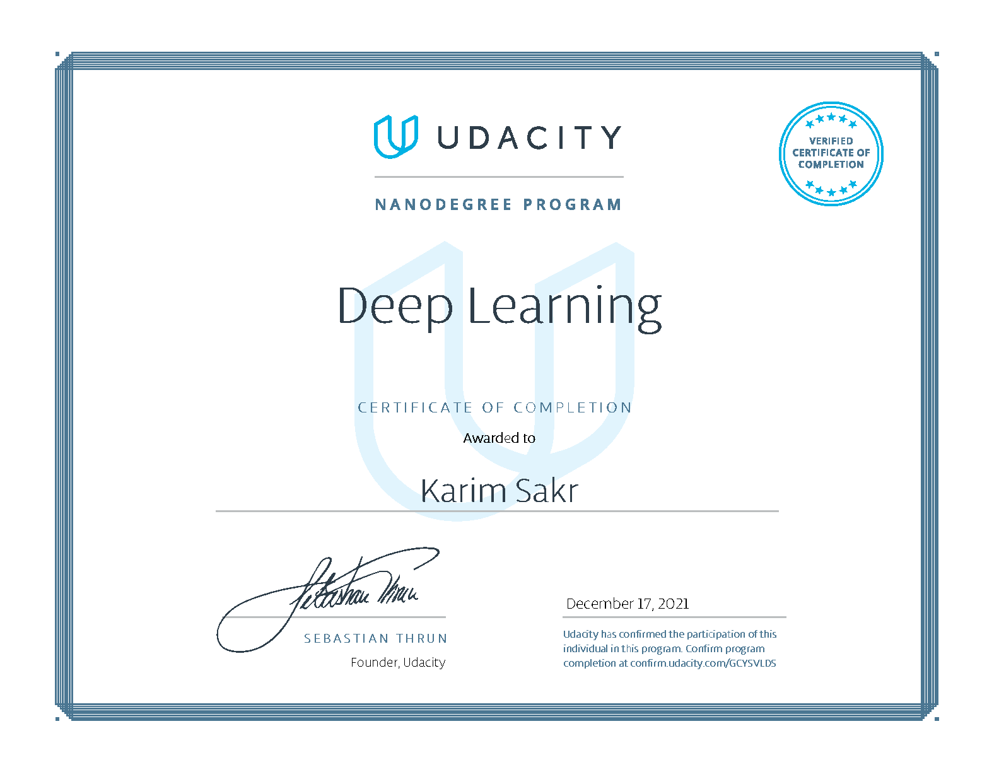

# UDACITY Deep Learning Nanodegree

### My implementation of projects for Udacity Deep Learning Nanodegree (December 2021).

#### Project 1: [Predicting Bike-Sharing Patterns](./1.%20Predicting%20Bike-Sharing%20Patterns/Predicting_bike_sharing_data.ipynb) 

* #### Udacity Personalised Project 1 [Review](./Reviews/1st.pdf) Passed

Project 2: [Landmark Classification & Tagging for Social Media](./2.%20Landmark%20Classification%20%26%20Tagging%20for%20Social%20Media/landmark.ipynb)

* #### Udacity Personalised Project 2 [Review](./Reviews/2nd.pdf) Passed

Project 3: [TV Script Generation](3.%20TV%20Script%20Generation/dlnd_tv_script_generation.ipynb)

* #### Udacity Personalised Project 3 [Review](./Reviews/3rd.pdf) Passed

Project 4: [Faces Generation](./4.%20Faces%20Generation/dlnd_face_generation.ipynb)

* #### Udacity Personalised Project 4 [Review](./Reviews/4th.pdf) Passed

Project 5: [Deploying a Sentiment Analysis Model on AWS](./5.%20Deploying%20a%20Sentiment%20Analysis%20Model%20on%20AWS/SageMaker%20Project.ipynb)

* #### Udacity Personalised Project 5 [Review](./Reviews/5th.pdf) Passed

### [Nanodegree Completion Certificate](https://confirm.udacity.com/GCYSVLDS)

